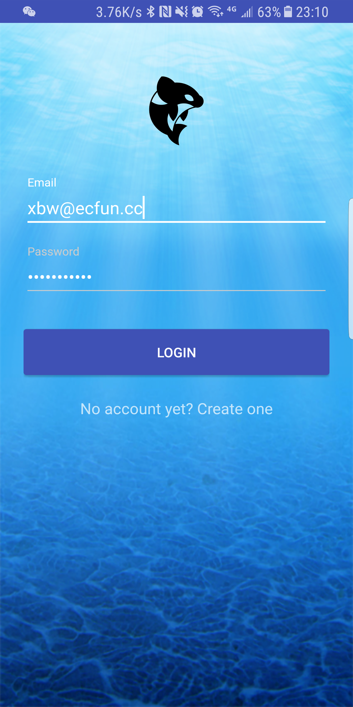
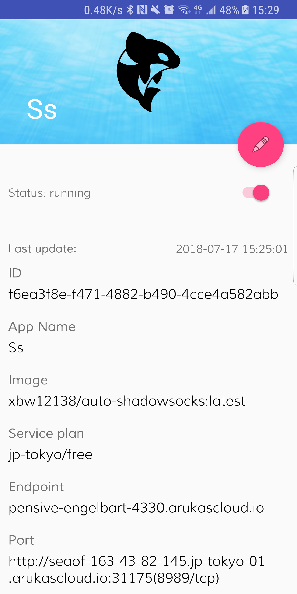
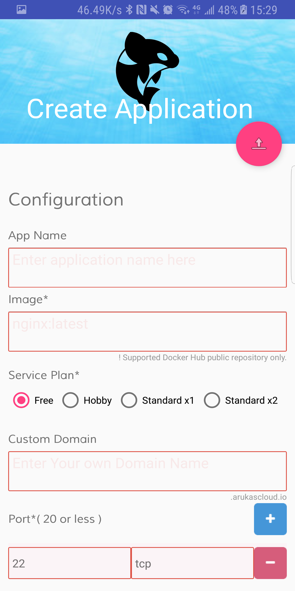
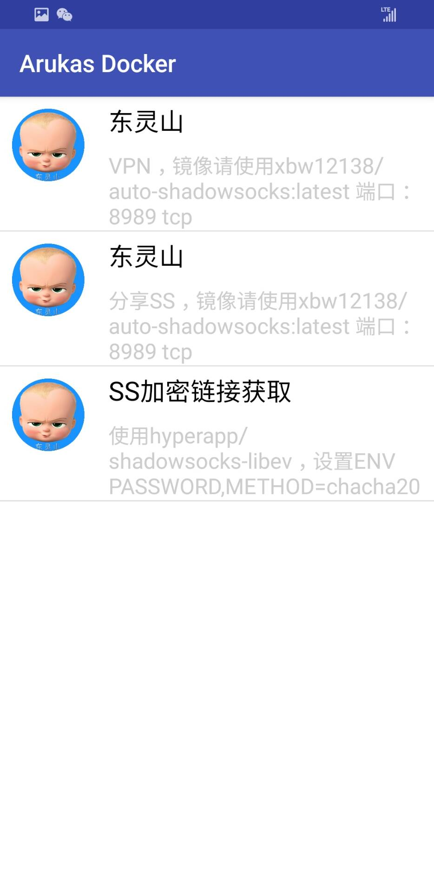
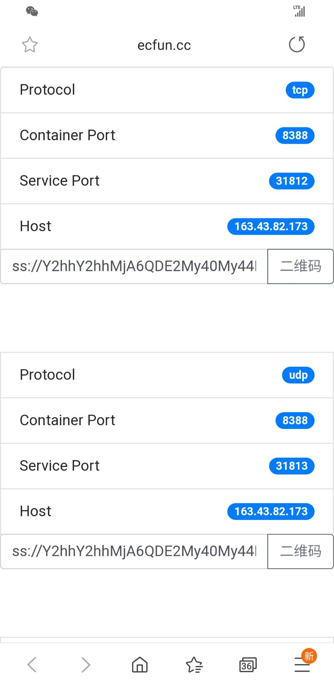

# Arukas Docker Pro

## Introduction
[ARUKAS CLOUD is DOCKER HOSTING](https://arukas.io/en/)
Life is short so why waste it doing something painful?
Arukas takes care of setting up, operating, and maintaining your own platform with Heroku-inspired workflow.
CaaS should not go complicated. The way it should be.
Just Keep it simple!

## Features
* You can easily create docker on your phone
* Powerful plug-in function, can be extended, easily access to docker information

## Extension (Plug-in)
Please Open Issue , Submit a Plug-in

* [x] Web Plug-in

```JSON
{
            "appname":"SS base64 encode",
            "packagename":"",
            "icon":"http://pic.ecfun.cc/15319632485b4fe770a11a4468221",
            "functioncode":102,
            "functionname":"SS url",
            "activity":"",
            "flag":"datajson",
            "appstore":"http://your_web_plugin_url?data=",
            "type":"web"
}
```
You will get docker detail json data, in this app, We'll open a link, 
`http://your_web_plugin_url?data=docker_detail_json_data`
docker_detail_json_data  !!! The data format is as follows

-------

* [x] App Plug-in


```JSON
{
            "appname":"VPN",
            "packagename":"com.xbw.mvp",
            "icon":"http://pic.ecfun.cc/15319632485b4fe770a11a4468221",
            "functioncode":103,
            "functionname":"获取SS驱动VPN",
            "activity":"com.xbw.mvp.ui.MainActivity",
            "flag":"datajson",
            "appstore":"https://fir.im/r95s",
            "type":"app"
}
```

1. `intent.getFlags()` in your Android application
2. jump to your application activity
3. `intent.getStringExtra("datajson")` flag is String "datajson"
4. if user's phone have not install your application, ask user to install in appstore

datajson  !!! The data format is as follows

### docker_detail_json_data. / datajson

```JSON
{
    "statuscode":200,
    "data":{
        "data":{
            "id":"bb0c7a63-1723-4992-9cdb-04948cbe53d6",
            "type":"services",
            "attributes":{
                "image":"hyperapp/shadowsocks-libev",
                "command":"",
                "instances":1,
                "cpus":0.1,
                "memory":null,
                "environment":[
                    {
                        "key":"PASSWORD",
                        "value":"xbw12138"
                    }
                ],
                "ports":[
                    "8388/tcp",
                    "8388/udp"
                ],
                "created-at":"2019-07-22T05:01:21.278Z",
                "updated-at":"2019-07-22T05:02:29.204Z",
                "status":"running",
                "subdomain":"cranky-bhabha-2922",
                "endpoint":"cranky-bhabha-2922.arukascloud.io",
                "custom-domain":"",
                "last-instance-failed-at":null,
                "last-instance-failed-status":null,
                "last-instance-failed-message":null,
                "port-mappings":[
                    [
                        {
                            "container-port":8388,
                            "host":"seaof-163-43-82-179.jp-tokyo-02.arukascloud.io",
                            "protocol":"tcp",
                            "service-port":31917
                        },
                        {
                            "container-port":8388,
                            "host":"seaof-163-43-82-179.jp-tokyo-02.arukascloud.io",
                            "protocol":"udp",
                            "service-port":31918
                        }
                    ]
                ]
            },
            "relationships":{
                "app":{
                    "data":{
                        "id":"74035c1f-e248-4da9-9f2b-63b42a72c1fb",
                        "type":"apps"
                    }
                },
                "service-plan":{
                    "data":{
                        "id":"jp-tokyo/free",
                        "type":"service-plans"
                    }
                }
            }
        },
        "meta":{

        },
        "links":{

        }
    }
}
```

## Demo Extension (Plug-in) 
[arukas_docker_extensions_base64_ss](https://github.com/xbw12138/arukas_docker_extensions_base64_ss)

## Download
[](https://play.google.com/store/apps/details?id=com.xbw.arukas)

## Screenshot






## Donation
Please install Arukas Docker Application in your phone, and click splash activity advertisement , thx!!!

## License
MIT License

Copyright (c) 2019 xubowen

Permission is hereby granted, free of charge, to any person obtaining a copy
of this software and associated documentation files (the "Software"), to deal
in the Software without restriction, including without limitation the rights
to use, copy, modify, merge, publish, distribute, sublicense, and/or sell
copies of the Software, and to permit persons to whom the Software is
furnished to do so, subject to the following conditions:

The above copyright notice and this permission notice shall be included in all
copies or substantial portions of the Software.

THE SOFTWARE IS PROVIDED "AS IS", WITHOUT WARRANTY OF ANY KIND, EXPRESS OR
IMPLIED, INCLUDING BUT NOT LIMITED TO THE WARRANTIES OF MERCHANTABILITY,
FITNESS FOR A PARTICULAR PURPOSE AND NONINFRINGEMENT. IN NO EVENT SHALL THE
AUTHORS OR COPYRIGHT HOLDERS BE LIABLE FOR ANY CLAIM, DAMAGES OR OTHER
LIABILITY, WHETHER IN AN ACTION OF CONTRACT, TORT OR OTHERWISE, ARISING FROM,
OUT OF OR IN CONNECTION WITH THE SOFTWARE OR THE USE OR OTHER DEALINGS IN THE
SOFTWARE.
